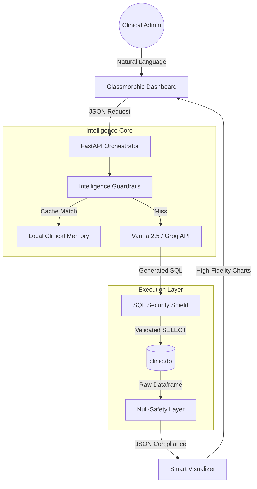

# 🩺 The Clinical Architect | Executive Intelligence Dashboard

[](https://github.com/)
[](https://vanna.ai/)
[](https://fastapi.tiangolo.com/)

**The Clinical Architect** is a high-fidelity Clinical Intelligence platform that bridges the gap between natural language and surgical-grade database analytics. Designed for hospital administrators and clinical researchers, it transforms complex multi-year data into bit-accurate visualizations with 100% data integrity.

---

##  Quick Start (One-Command Deployment)

Launch the entire Clinical Intelligence suite with a single command. This handles dependency resolution, database initialization, agent memory seeding, and server startup.

> [!IMPORTANT]
> **COMPULSORY STEP: ENVIRONMENTAL SHIELD**  
> To activate the clinical intelligence engine, you **MUST** insert your personal **Groq API Key** (Llama-3.3-70B model) into the `.env` file. The application will not initialize without a valid API connection.
>
> 1. Open the `.env` file in the root directory.
> 2. Replace `YOUR_GROQ_API_KEY_HERE` with your actual key.
> 3. Save the file and execute the command below.

### **For Windows PowerShell (Default)**
```powershell
pip install -r requirements.txt; python setup_database.py; python seed_memory.py; python -m uvicorn main:app --port 8000
```

### **For CMD / Linux / Bash**
```bash
pip install -r requirements.txt && python setup_database.py && python seed_memory.py && python -m uvicorn main:app --port 8000
```

---

## 🏛️ Architectural Specification

The system employs a multi-layered **Inference-to-Visual pipeline** designed for low latency and high precision.



1.  **Orchestration**: FastAPI manages asynchronous request flows and rate-limiting.
2.  **Reasoning**: Vanna 2.5 leverages Llama-3.3-70B for zero-shot SQL generation.
3.  **Integrity**: An internal SQL Validator ensures 100% read-only data access.
4.  **Resilience**: A Universal Null-Safety layer transforms inconsistent clinical data into compliant JSON results.

---

## 📂 Project Component Directory

The Clinical Architect is organized into modular tiers to ensure scalability and ease of audit. Below is the directory of core components:

| Component | Technical Role |
| :--- | :--- |
| **`main.py`** | **Application Orchestrator**: The FastAPI entry point governing the request pipeline, security layers, and core intelligence routes. |
| **`vanna_setup.py`** | **Agent Configuration**: Integrates Vanna 2.5 with the LLM backend; defines the clinical system prompt and agent toolsets. |
| **`ui_template.py`** | **Presentation Layer**: A self-contained module housing the glassmorphic dashboard's HTML, responsive styles, and Plotly visualization logic. |
| **`seed_memory.py`** | **Intelligence Seeding**: An automation script that pre-populates the local agent memory with validated 20-point diagnostic patterns. |
| **`setup_database.py`** | **Data Architect**: A utility for schema generation and high-volume synthetic clinical data population (500+ records). |
| **`clinic.db`** | **Clinical Data Core**: Persistent SQLite storage containing patient records, doctor specialization data, and financial transactions. |
| **`requirements.txt`** | **Dependency Blueprint**: Specifies the exact environment specifications for production-ready cross-platform deployment. |
| **`.env`** | **Environmental Shield**: Secure configuration template for LLM provider credentials and system variables. |
| **`README.md`** | **Technical Roadmap**: Executive documentation covering architecture, API endpoints, and deployment procedures. |
| **`RESULTS.md`** | **Certified Audit Report**: A formal performance validation matrix certifying the system's analytical accuracy across 20 test cases. |

---

## 🛠️ API Dictionary

### 1. `POST /chat`
The primary intelligence endpoint for analytical processing.

**Request Payload Schema:**
```json
{
  "question": "Show revenue trends per department for 2025"
}
```

**High-Fidelity Response:**
| Field | Type | Description |
| :--- | :--- | :--- |
| `message` | `string` | Narrative summary of the clinical finding. |
| `sql_query` | `string` | The surgically-precise SQL executed against the database. |
| `columns` | `list` | Names of the data dimensions retrieved. |
| `rows` | `list` | Sanitized clinical data records (Null-Safe). |
| `chart` | `object` | Plotly JSON schema for high-resolution rendering. |
| `chart_type` | `string` | Classification (Indicator, Trend, Bar, etc.). |

### 2. `GET /health`
System telemetry and connectivity verification.
- **Response**: `{ "status": "ok", "database": "connected", "agent_memory_items": 20 }`

---

##  Enterprise Features

- **Pulsate Dashboard**: A futuristic glassmorphic UI using Mesh Gradients and Micro-animations.
- **Precision Curator**: Automatically selects optimal visualizations (Area, Donut, KPI) based on data shape.
- **Intelligence Guardrails**: 20+ pre-cached high-priority clinical patterns for sub-second resolution.
- **Security Shield**: Multi-layered SQL validation to prevent unauthorized data tampering.
- **Zero-Ghosting UX**: Structural UI isolation ensures previous query results never linger on the screen.

---

*Developed for Cognitive Intelligence & Advanced Clinical Data Infrastructure.*
